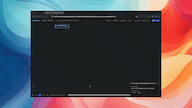

# [cuddlytoddly](https://cuddlytoddly.com)

*Holding AI's hand through planning and into execution.*

[](https://pypi.org/project/cuddlytoddly/)
[](https://pypi.org/project/cuddlytoddly/)
[](LICENSE)
[](https://github.com/3IVIS/cuddlytoddly/actions)

**Most LLM agents jump straight into action. cuddlytoddly builds a complete, editable task plan first — so you always know what it's about to do, and can change it before, during, or after execution.**

Give it a goal and cuddlytoddly builds an explicit plan — a visible, editable graph of tasks and dependencies — before touching anything. Inspect it, change it, or redirect it at any point. When you're ready, it carries the plan out with real tools, quality-checks the results, and keeps going until the job is done.



> ⭐ If cuddlytoddly is useful to you, a star helps others find it.

---

## Try it now — no install required

Two complete, unedited runs as fully interactive HTML snapshots. Open them in your browser, explore the task graph, and see exactly what cuddlytoddly produces:

| Goal | Interactive snapshot |
|---|---|
| How to build a SaaS business | **[→ Open demo](https://cuddlytoddly.com/runs/how_to_build_a_saas_business.html)** |
| How to negotiate a raise | **[→ Open demo](https://cuddlytoddly.com/runs/how_to_negotiate_a_raise.html)** |

Snapshots are fully self-contained HTML files — no server, no login, no install.

---

## Why cuddlytoddly?

AI models are capable, but left alone on long-horizon goals they miss dependencies, skip implicit steps, and wander off track. The problem isn't intelligence — it's the absence of structure and oversight.

cuddlytoddly's answer is to make the plan explicit and keep the human in control of it. Before a single tool is called, the system produces a full task graph you can read and edit. You can pause execution at any point, change a task's description, add or remove a dependency, promote a task into a subgoal for a finer breakdown, or switch goals entirely — and execution resumes from the updated state. Nothing runs without a declared intent, and no intent is locked in.

Think of it as holding AI's hand through planning and into execution — not blind autonomy, but guided, inspectable, interruptible progress.

### How it compares

|  | cuddlytoddly | LangGraph | CrewAI | AutoGPT |
|--|:--:|:--:|:--:|:--:|
| Explicit plan before execution | ✅ | ❌ | ❌ | ❌ |
| Live plan editing during a run | ✅ | ❌ | ❌ | ❌ |
| Pause & redirect at any time | ✅ | ❌ | ❌ | ❌ |
| Crash-proof resume | ✅ | ⚠️ partial | ❌ | ❌ |
| Web UI with editable task graph | ✅ | ❌ | ❌ | ❌ |
| Local model support | ✅ | ✅ | ✅ | ❌ |
| Zero-config backend switching | ✅ | ❌ | ❌ | ❌ |

---

## How it works

1. A plain-English **goal** is seeded into the graph. Nothing runs yet.
2. The **LLMPlanner** generates a **clarification node** before any task is created. It first extracts every concrete fact already stated in your goal (budget, size, hard constraints, locations, roles, etc.) and pre-fills those as known fields. It then identifies what genuinely missing context would most change what tasks are needed — and marks those fields `unknown` for you to optionally fill in. Information that can be fetched at runtime (market prices, public statistics, regulatory text) is never surfaced as a user question.
3. The **LLMPlanner** builds an explicit plan — a DAG of tasks with declared dependencies and expected outputs — before any execution begins. The draft plan passes through an optional self-review pass, structural validation, and deterministic constraint checks before any node is committed to the graph.
4. **You can inspect and edit the plan** at this point, or at any point during execution. Pause the LLM, change a task description, add or remove a dependency, promote a task to a subgoal for finer breakdown, or switch goals entirely. Only affected branches re-run — completed work is preserved.
5. The **Orchestrator** picks up ready nodes and dispatches them to the **LLMExecutor** concurrently.
6. The executor runs a multi-turn LLM loop, calling real tools (code execution, file I/O, custom skills) until the task produces a concrete result.
7. The **QualityGate** checks each result against declared outputs; if something is missing it injects a bridging task automatically.
8. Every mutation is written to an **event log** — crash and resume from exactly where you left off, with no lost work.

```
goal → [clarification fields] → LLMPlanner → [scrutinize?] → [validate] → [constraint check]
               ↑ user can edit                                                      │
               └── on confirm → resets children → partial replan              TaskGraph (DAG)
                                                                                    │
                                                                        Orchestrator
                                                                        ├── LLMExecutor + tools
                                                                        └── QualityGate (verify / bridge)
                                                                                    │
                                                                               EventLog (JSONL) → crash-proof replay
```

---

## Installation

```bash
pip install cuddlytoddly
```

**Requirements:** Python 3.11+, `git` on your PATH (for the DAG visualiser).

Then install the extra for your chosen LLM backend:

| Backend | Extra to install |
|---|---|
| Anthropic Claude | `pip install cuddlytoddly[claude]` |
| OpenAI / compatible | `pip install cuddlytoddly[openai]` |
| Local llama.cpp | `pip install cuddlytoddly[local]` — see [Local model setup](#local-model-setup-llamacpp) |
| Everything | `pip install cuddlytoddly[all]` |

---

## Quick start

```bash
pip install cuddlytoddly[claude]
export ANTHROPIC_API_KEY=sk-ant-...
cuddlytoddly "Write a market analysis for electric scooters"
```

On first run, a `config.toml` is written to your user data directory with all defaults pre-filled. Open it to change backends, model settings, temperature, and more — **no code editing required**.

```bash
# Print the config file location
python -c "from cuddlytoddly.config import CONFIG_PATH; print(CONFIG_PATH)"
```

Pass no argument to open the startup screen (resume a previous run, load a manual plan, etc.). The web UI opens automatically showing the full task plan — inspect or edit it before execution starts, or just let it run. You can pause, redirect, or promote any task to a subgoal at any time.

### Switching backends

Edit `[llm] backend` in `config.toml`. That's the only change needed.

```toml
# config.toml

[llm]
backend = "claude"    # or "openai" or "llamacpp"

[claude]
model = "claude-opus-4-6"

[openai]
model    = "gpt-4o"
# base_url = "https://api.together.xyz/v1"   # any OpenAI-compatible provider
```

| Backend | Extra | Env var |
|---|---|---|
| `claude` | `pip install cuddlytoddly[claude]` | `ANTHROPIC_API_KEY` |
| `openai` | `pip install cuddlytoddly[openai]` | `OPENAI_API_KEY` |
| `llamacpp` | see [Local model setup](#local-model-setup-llamacpp) | — |

---

## Local model setup (llama.cpp)

Running a model locally gives you full privacy, no API costs, and offline operation. The local backend uses [llama-cpp-python](https://github.com/abetlen/llama-cpp-python).

### Step 1 — Install llama-cpp-python

Choose the command that matches your hardware:

**macOS (Apple Silicon — Metal GPU)**
```bash
CMAKE_ARGS="-DGGML_METAL=on" pip install llama-cpp-python --force-reinstall --no-cache-dir
```

**Linux / Windows — NVIDIA GPU (CUDA)**
```bash
CMAKE_ARGS="-DGGML_CUDA=on" pip install llama-cpp-python --force-reinstall --no-cache-dir
```

**Linux — CPU only**
```bash
pip install llama-cpp-python
```

For other hardware (ROCm, Vulkan, SYCL), see the [official installation guide](https://github.com/abetlen/llama-cpp-python#installation).

Then install the remaining extras:
```bash
pip install cuddlytoddly[local]
```

### Step 2 — Download a model

Models must be in **GGUF format**. The default model is **Llama 3.3 70B Instruct Q4_K_M**.

If you already have this model downloaded via `llama-cli -hf`, `llama-server -hf`, or `huggingface-cli download`, cuddlytoddly will find it automatically. It probes these locations in order:

1. `CUDDLYTODDLY_MODEL_PATH` env var — explicit override, any path
2. `~/.cache/llama.cpp/` — llama.cpp's native download cache
3. `~/.cache/huggingface/hub/` — Hugging Face hub cache
4. `<data dir>/models/` — cuddlytoddly's own models folder

**To download the default model:**

```bash
pip install huggingface-hub

# Linux / macOS
DATA_DIR=$(python -c "from platformdirs import user_data_dir; print(user_data_dir('cuddlytoddly', '3IVIS'))")
mkdir -p "$DATA_DIR/models"
huggingface-cli download bartowski/Llama-3.3-70B-Instruct-GGUF \
  Llama-3.3-70B-Instruct-Q4_K_M.gguf \
  --local-dir "$DATA_DIR/models"

# Windows PowerShell
$dataDir = python -c "from platformdirs import user_data_dir; print(user_data_dir('cuddlytoddly', '3IVIS'))"
New-Item -ItemType Directory -Force "$dataDir\models"
huggingface-cli download bartowski/Llama-3.3-70B-Instruct-GGUF Llama-3.3-70B-Instruct-Q4_K_M.gguf --local-dir "$dataDir\models"
```

**To use a different model:**
```bash
export CUDDLYTODDLY_MODEL_PATH=/path/to/your-model.gguf
```

### Step 3 — Configure and run

```toml
# config.toml
[llm]
backend = "llamacpp"

[llamacpp]
model_filename = "Llama-3.3-70B-Instruct-Q4_K_M.gguf"
n_gpu_layers   = -1    # -1 = all layers on GPU, 0 = CPU only
n_ctx          = 16384
max_tokens     = 8192
temperature    = 0.1
cache_enabled  = true
```

```bash
cuddlytoddly "Write a market analysis for electric scooters"
```

The first run loads the model into memory (10–30 seconds), then proceeds normally. Subsequent runs reuse the response cache to skip identical prompts.

---

## Customising prompts and schemas

All LLM prompt templates and JSON output schemas are consolidated into two files:

| File | What it contains |
|---|---|
| `cuddlytoddly/planning/prompts.py` | Every prompt template: planner, scrutinizer, ghost node resolution, executor, verify-result, check-dependencies, system prompt constants. |
| `cuddlytoddly/planning/schemas.py` | Every JSON schema: `PLAN_SCHEMA`, `EXECUTION_TURN_SCHEMA`, `RESULT_VERIFICATION_SCHEMA`, `GHOST_NODE_RESOLUTION_SCHEMA`, etc. |

Each function in `prompts.py` uses standard Python f-strings with named parameters — edit the text freely without touching the implementation.

---

## Adding skills

Drop a folder with a `SKILL.md` (and optional `tools.py`) into `cuddlytoddly/skills/`. The `SkillLoader` discovers it automatically. See [docs/skills.md](https://github.com/3IVIS/cuddlytoddly/blob/main/docs/skills.md) for the full format.

---

## Python API

```python
from cuddlytoddly.planning.llm_interface import create_llm_client
from cuddlytoddly.planning.llm_planner   import LLMPlanner
from cuddlytoddly.planning.llm_executor  import LLMExecutor
from cuddlytoddly.engine.quality_gate    import QualityGate
from cuddlytoddly.engine.llm_orchestrator import Orchestrator
from cuddlytoddly.skills.skill_loader    import SkillLoader
from cuddlytoddly.core.task_graph        import TaskGraph

# Swap "claude" for "openai" or "llamacpp" — everything else is identical
llm      = create_llm_client("claude", model="claude-opus-4-6")
graph    = TaskGraph()
skills   = SkillLoader()

orchestrator = Orchestrator(
    graph=graph,
    planner=LLMPlanner(
        llm_client=llm, graph=graph,
        skills_summary=skills.prompt_summary,
        scrutinize_plan=True,   # LLM self-reviews each draft plan before execution
    ),
    executor=LLMExecutor(llm_client=llm, tool_registry=skills.registry),
    quality_gate=QualityGate(llm_client=llm, tool_registry=skills.registry),
)

orchestrator.start()   # graph is live and editable at any point

orchestrator.stop_llm_calls()    # pause — in-flight tasks complete, nothing new starts
orchestrator.resume_llm_calls()  # resume from current state
```

See [docs/api.md](https://github.com/3IVIS/cuddlytoddly/blob/main/docs/api.md) for the full API reference — all class signatures, constructor arguments, and event system details.

---

## Documentation

| Doc | Contents |
|---|---|
| [Architecture](https://github.com/3IVIS/cuddlytoddly/blob/main/docs/architecture.md) | How the components fit together |
| [Configuration](https://github.com/3IVIS/cuddlytoddly/blob/main/docs/configuration.md) | LLM backends, run directory, tuning parameters, environment variables |
| [Skills](https://github.com/3IVIS/cuddlytoddly/blob/main/docs/skills.md) | Built-in skills and how to add custom ones |
| [API Reference](https://github.com/3IVIS/cuddlytoddly/blob/main/docs/api.md) | Public Python API — full class and method signatures |

---

## Project structure

```
cuddlytoddly/
├── core/           # TaskGraph, events, reducer, ID generator
├── engine/         # Orchestrator, QualityGate, ExecutionStepReporter
├── infra/          # Logging, EventQueue, EventLog, replay
├── planning/
│   ├── prompts.py              ← all LLM prompt templates (edit here)
│   ├── schemas.py              ← all JSON output schemas (edit here)
│   ├── llm_interface.py
│   ├── llm_planner.py
│   ├── llm_executor.py
│   ├── llm_output_validator.py
│   └── plan_constraint_checker.py
├── skills/         # SkillLoader + built-in skill packs
│   ├── code_execution/
│   └── file_ops/
└── ui/             # Curses terminal UI, web UI, Git DAG projection
docs/
pyproject.toml
LICENSE
```

---

## Where is my data?

Run data and models are stored in the OS user data directory, separate from the package:

```bash
python -c "from platformdirs import user_data_dir; print(user_data_dir('cuddlytoddly', '3IVIS'))"
```

```
~/.local/share/cuddlytoddly/              ← Linux
~/Library/Application Support/cuddlytoddly/  ← macOS
%LOCALAPPDATA%\3IVIS\cuddlytoddly\        ← Windows

├── config.toml
├── models/
└── runs/
    └── write_a_market_analysis.../
        ├── events.jsonl         # full event log — enables crash recovery
        ├── api_cache.json       # response cache (claude / openai backends)
        ├── llamacpp_cache.json  # response cache (llamacpp backend)
        ├── logs/
        ├── outputs/             # working directory for file-writing tools
        └── dag_repo/            # Git repo mirroring the DAG
```

---

## Contributing

Contributions are welcome — bug fixes, new features, new skills, new backends, and documentation improvements.

See [CONTRIBUTING.md](CONTRIBUTING.md) to get started. The easiest entry point is [adding a skill](CONTRIBUTING.md#adding-a-new-skill) — no core code changes required.

---

## License

MIT — see [LICENSE](LICENSE).